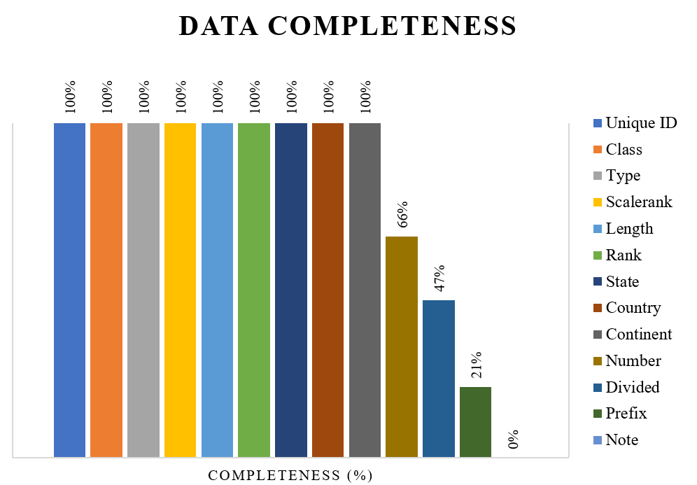

# **About**
Additional statistics will be shown include checking the validity of the data, seeing if businesses overlap the road geometries, and additional descriptive statistics of road attributes
 

# **Validity**
Validity was checked using PostGIS function ST_IsValidDetail. The results are following:

| Total records | Valid | Invalid |
|-------|-----|--------|
| 1316 | 1316  | 0 |

As it can be seen, all 1316 records have valid geometries.

# **Data completeness**

In the following plot we see that most attributes have 100% completeness. Number, divided, prefix, and note had missing values. Moreover, the dataset did not contain good documentation, so the meaning of some attributes was unclear. Because of that, these attributes were not used in this analysis.

  

# **Businesses overlapping**

It was checked whether some busineeses overlap with road geometries using PostGIS. The buffer used was 5 meters. The data shows that 25 businesses are indeed on roads. However, further examination of said records using satellite images proved othervise.

| Total records | Overlap a road | Do not overlap a road |
|-------|-----|--------|
| 500 | 25  | 475 |

# **Additional descriptive statistics**

The dataset contains information about road classes and road types. 

Classes are as follows:
1.	Federal – constructed, owned, and maintained by the federal government. 
2.	Interstate – restricted access roadways that go across state boundaries to connect different states
3.	State – maintained and built by the state, not the local authorities
4.	Other

The distribution of road classes is shown is the following table:

| Road class | Count | 
|-------|-----|
| State | 604  |
| Other | 442  |
| Federal | 208  |
| Interstate | 62  |

