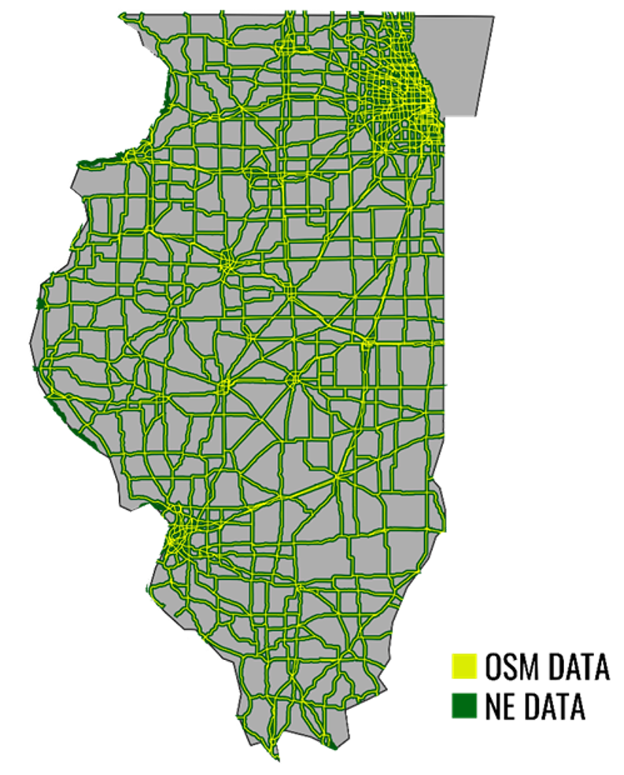
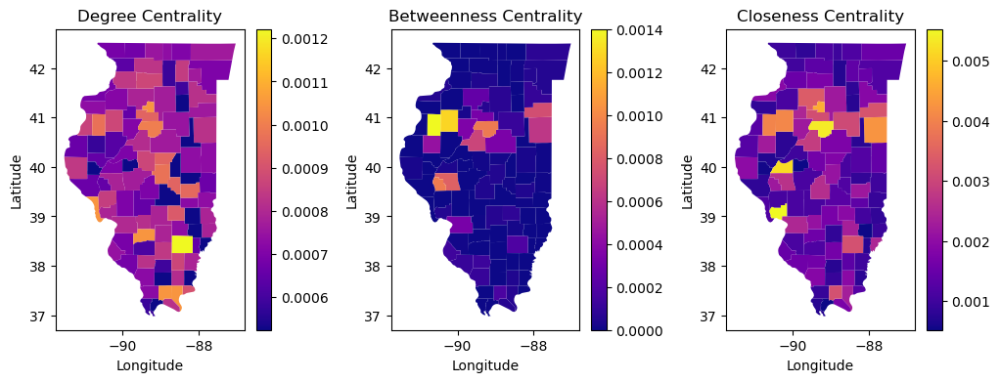

# **About**

The goals of this analysis are to validate Illinois road data and to see if some improvements can be made that would improve the quality of transport network.

Four datasets were used:
1. [Road dataset by Natural Earth](https://www.naturalearthdata.com/downloads/10m-cultural-vectors/roads/)
2. [Counties dataset by Natural Earth](https://www.naturalearthdata.com/downloads/10m-cultural-vectors/10m-admin-2-counties/)
3. [Illinois roads by OSM](https://download.geofabrik.de/north-america/us/illinois.html)
4. [Businesses operating in Chicago](./Resources/data/businesses.csv)

The mentioned datasets were processed so only the data about the state of Illinois remained.

Python, QGIS, PostGIS, and PostgreSQL were used to conduct this analysis.

 

# **Analysis**

The data was first validated and then centrality measure were calculated to give suggestions for transport network improvement

## **Data Validation**

The data was validated using several methods. Firstly, the validity of geometries was checked using PostGIS. All records were proven to be valid. Next, it was checked whether some businesses overlap the road geometries. Even though the results show that 25 records do overlap, examination of satellite images proved otherwise. These validation checks can be found in [Additonal Statistics](./Additional%Statistics). 

Next, crossvalidation was done with OSM maps. All roads do overlap OSM roads with the exception of roads that officially belong to other the neigboring states, but do cross the border. These roads were not included in the OSM dataset. 

  

 

## **Centrality measures**

In graph theory and network analysis, indicators of centrality assign numbers or rankings to nodes within a graph corresponding to their network position. It is a great tool that can be utilized for this analysis. Centrality measures are among the most widely used indices based on network data. In this analysis, three centrality measures were calculated for each county in Illinois:

- Degree centrality, which shows the number of connections each node has in the network. Nodes are considered more central if they have more connections.
- Betweenness centrality, which shows how often a node is the shortest path between two other nodes.
- Closeness centrality, which shows how quickly a node can communicate with other nodes in the network.

The results of these calculations are the following:

### **Degree centrality**

It is visible that most counties have a medium to a high degree of centrality. There are some counties with extremely low degree of centrality. This indicates that they are not well-connected to the rest of the network. It is worth investigating why these counties have a low connection to other parts of the network, and, if possible, invest in building roads that would increase their connectivity.

### **Betweenness centrality**
It is visible that most counties have low betweenness centrality. This means that the road network is relatively decentralized, i.e. there are not many areas where the transport networks is congested. Counties Warren and Knox have extremely high betweenness centrality in comparison to others. These two counties are important transportation hubs in the whole state of Illinois. Roads can be built here to decrease the transport load.
### **Closeness centrality**
Closeness centrality is at its peak in the middle of the state. This indicates that this area has good access to the other parts of the network. Counties  Woodford and Cass stand out. Woodford is a major intesection of roads and railroads, which explains its high closeness centrality. Cass' neighboring counties have low degree centrality so more roads can be built here to connect it to its neighbors and increase their connectivity to the rest of transport network.

 

# **Summary**

The results of this analysis show that Natural Earth’s data is completely valid when it comes to road data. There were no intersections with business data, geometries were valid, and the data almost completely matched the OSM data. 

Based on all the data acquired, it is shown that some improvements can be made in several counties which would help improve Illinois' transport network.

# **License**

All files in this project are licensed under the [GNU General Public License v3.0](./LICENSE).